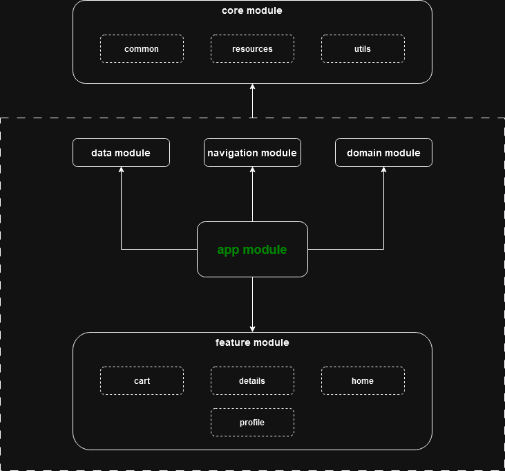

### market-app

## stack:
- multi-module architecture
- MVVM
- dependency injection (koin)
- ktor-client
- jetpack compose
- navigation compose
- kotlin flow
- kotlin coroutines

## architecture

## preview

